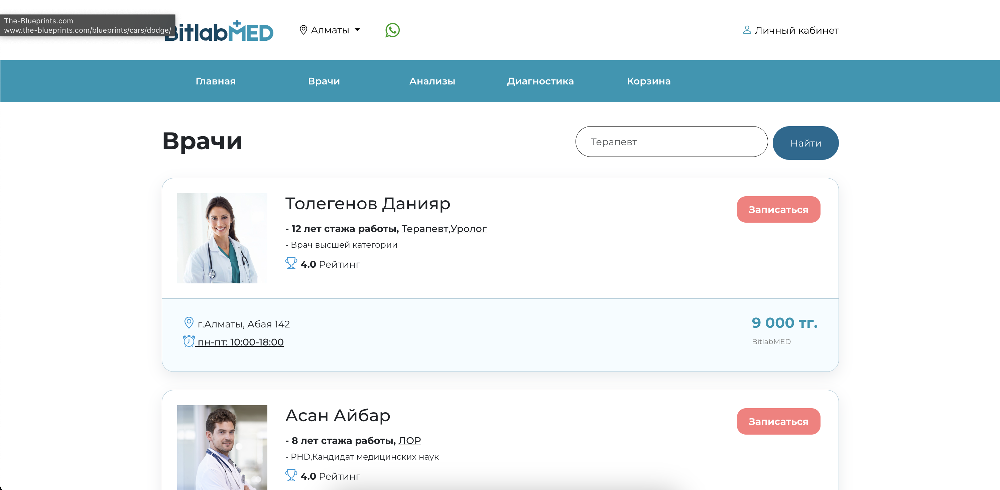
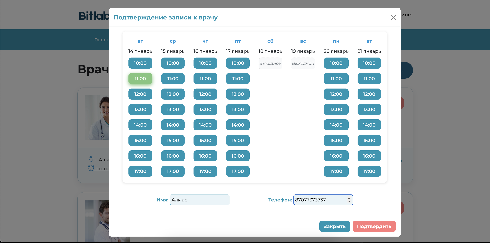
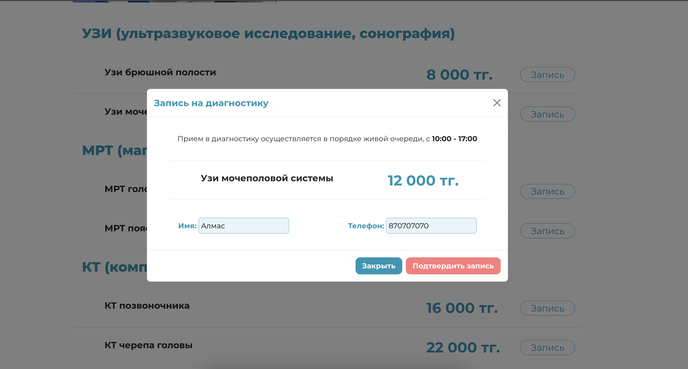
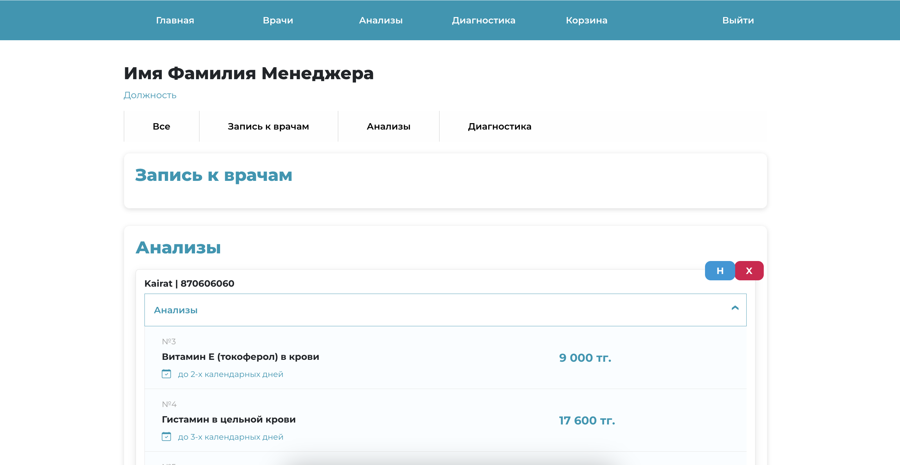
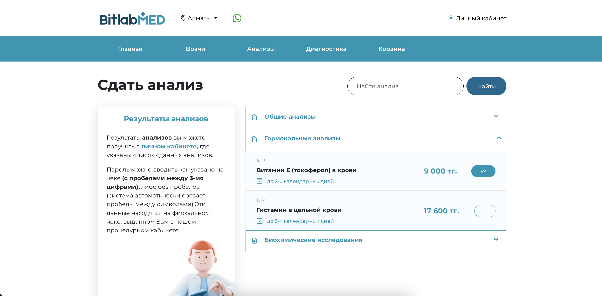
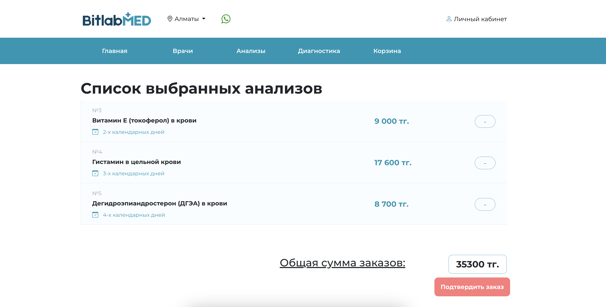

# Система управления медицинскими записями

## Описание проекта
Этот проект представляет собой веб-приложение для управления медицинскими записями. Он предоставляет пользователям, врачам и менеджерам возможность эффективно взаимодействовать в рамках медицинских услуг, таких как консультации врачей, диагностика и сдача анализов.


Основная цель проекта — упрощение записи на прием, улучшение управления заявками и автоматизация процесса отслеживания посещений и результатов.

## Основные возможности

### Для пользователей (пациентов):
- **Запись к врачу**: Удобный интерфейс для записи на прием к врачу, выбор специалиста и времени. Возможность отмены записи.
- **Запись на диагностику**: Возможность записаться на диагностику (например, МРТ, КТ).
- **Запись на анализы**: Просмотр и выбор анализов с добавлением в корзину, быстрый поиск по названию.
- **История заказов**: Доступ к истории всех записей (врачи, диагностика, анализы) с просмотром деталей и результатов.
- **Управление заявками**: Возможность отменить или изменить статус заявки, просматривать результаты анализов по завершенным заявкам.





### Для врачей:
- **Личный кабинет врача**: Просмотр записей пациентов на неделю с возможностью отметить приход пациента или удалить запись.
- **Управление статусом посещений**: Автоматическое обновление записей с изменением цвета на зеленый при подтверждении прихода пациента.

### Для менеджеров:
- **Управление заявками**: Возможность просматривать, редактировать или удалять заявки, а также отмечать их как "Закрытые" (обработанные).

### Общий функционал:
- **Поиск и фильтрация**: Возможность поиска анализов, диагностик и врачей с использованием фильтров по имени и категории.
- **Интерактивные элементы**: AJAX-запросы для обновления данных без перезагрузки страницы (например, добавление анализа в корзину или изменение статуса заявки).
- **Безопасность и авторизация**: Использование Spring Security для разграничения доступа на основе ролей (пользователь, врач, менеджер).





## Технологии и инструменты
- **Back-end**: Spring Boot (REST API, Spring Security, Hibernate)
- **Front-end**: HTML, CSS, Bootstrap, Thymeleaf, JavaScript, AJAX
- **База данных**: PostgreSQL
- **Инструменты разработки**: Git, Postman для тестирования API, Docker для контейнеризации

## Основные достижения
- Реализован интерактивный интерфейс для всех ролей.
- Полная история записей и результатов для пациентов.
- Динамическое управление заявками и статусом посещений для врачей и менеджеров.
- Эффективное использование Spring Boot для построения REST API и PostgreSQL для хранения данных.

## Вывод
Проект демонстрирует комплексный подход к автоматизации медицинских записей и управления заявками. Он улучшает взаимодействие между пациентами и медицинским персоналом, повышает качество обслуживания и упрощает административные процессы.

Этот завершенный проект готов к демонстрации и использованию.





## Запуск проекта

1. Клонирование репозитория
2. Запуск с помощью Docker Compose
3. Убедитесь, что у вас установлен Docker и Docker Compose. Проект автоматически поднимет все необходимые сервисы: PostgreSQL и сам сервис.
4. После запуска сервис будет доступен по адресу: http://localhost:7777/


🛠️ Используемые технологии:

- Java 21
- Spring Boot
- PostgreSQL (17)
- Docker
- MapStruct
- Flyway
- Spring Security

### **Подробности для пользователей**  

```markdown
## Тестовые аккаунты

### Пациенты:
- **email:** user@mail.ru | **password:** user  
- **email:** kairat@mail.ru | **password:** kairat  

### Менеджер:
- **email:** manager@mail.ru | **password:** manager  

### Врачи:
- **email:** doni@mail.ru | **password:** doni  
- **email:** aibar@mail.ru | **password:** aibar  
- **email:** dimash@mail.ru | **password:** dimash  


